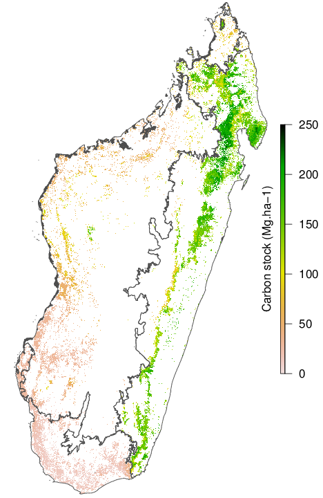

# carbonmap

## Content of the GitHub repository

R script and data to reproduce the results from Vieilledent et al. 2016.

## National forest carbon map

Figure: National 250m forest carbon map for Madagascar for the year 2010.

## References

Vieilledent, Ghislain, Oliver Gardi, Clovis Grinand, Christian Burren, Mamitiana Andriamanjato, Christian Camara, Charlie J. Gardner, et al. 2016. Bioclimatic Envelope Models Predict a Decrease in Tropical Forest Carbon Stocks with Climate Change in Madagascar. *Journal of Ecology*, n/a–n/a. doi:[10.1111/1365-2745.12548](http://dx.doi.org/10.1111/1365-2745.12548).